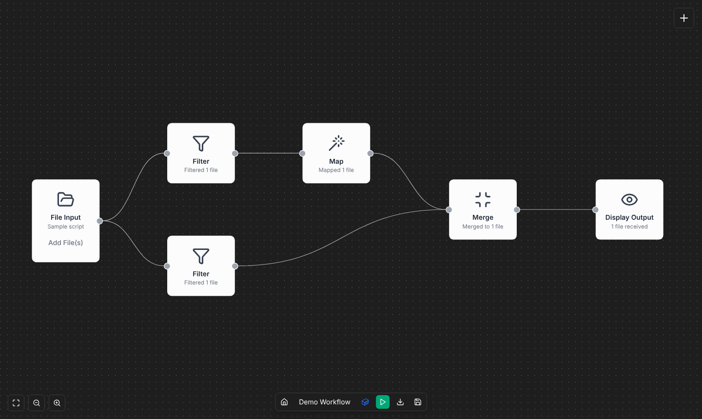

# N-WAVE

**Nextflow Workflow Authoring and Visualization Environment**

[](https://github.com/HCIstudio/N-WAVE/actions/workflows/test.yml)
[](https://hcistudio.github.io/N-WAVE/)
[](https://github.com/HCIstudio/N-WAVE/releases/latest)
[](https://hub.docker.com/r/hcistudio/nwave-frontend)
[](https://hub.docker.com/r/hcistudio/nwave-backend)
[](LICENSE)

N-WAVE is a visual editor for [Nextflow](https://www.nextflow.io/) pipelines. You build a
workflow by dragging nodes onto a canvas — file inputs, operators, processes, and output
displays — connect them, and N-WAVE generates a runnable Nextflow script from the graph. You
can then execute the workflow and inspect its results from the browser.



- **Live demo:** https://hcistudio.github.io/N-WAVE/ — runs in the browser with no install. Workflows can be built, edited and exported, including nf-core modules from the library and custom nodes (stored in your browser), but not executed (that needs the backend).
- **Documentation:** the [Wiki](https://github.com/HCIstudio/N-WAVE/wiki) covers authoring workflows, the node reference, and running via Docker.

## Components

| Piece | Tech | Responsibility |
|-------|------|----------------|
| Frontend | React, Vite, TypeScript, [React Flow](https://reactflow.dev/), Tailwind | The visual canvas and the client-side Nextflow script generator. |
| Backend | Node, Express, TypeScript, Mongoose | Workflow persistence and execution. |
| Database | MongoDB | Stores saved workflows. |
| Runner | `nextflow/nextflow` Docker image | Pulled on demand by the backend to run pipelines. |

## Architecture

```
                     ┌──────────────────────────────────────────────┐
   browser  ───────► │  frontend (nginx)  :5173                      │
                     │   • React Flow canvas + Nextflow generator    │
                     │   • proxies /api ─────────────┐               │
                     └───────────────────────────────┼───────────────┘
                                                     │
                     ┌───────────────────────────────▼───────────────┐
                     │  backend (Express)  :5001                      │
                     │   • /api/workflows  → persistence (MongoDB)    │
                     │   • /api/execute    → runs Nextflow  ──────┐   │
                     └────────────┬───────────────────────────────┼───┘
                                  │                                │
                     ┌────────────▼─────────┐        ┌─────────────▼────────────┐
                     │   MongoDB  :27017     │        │  nextflow/nextflow (run   │
                     │   saved workflows     │        │  on the host's Docker)    │
                     └───────────────────────┘        └───────────────────────────┘
```

- The frontend owns the canvas and turns the node graph into a Nextflow script
  (`frontend/src/generators/`). The script is generated in the browser.
- The backend persists workflows to MongoDB and executes them. It exposes a small REST API
  under `/api` (`workflows`, `execute`, `nfcore`, `custom-nodes`).
- The frontend talks to the backend only through `frontend/src/api.ts`. In the online demo
  that client is swapped for an in-browser store (`frontend/src/demo/`), which is why the
  demo needs no backend.

### How workflow execution works

The backend does not bundle Nextflow. When you run a workflow it launches the official
`nextflow/nextflow` image on the host's Docker daemon and shares files with it via
`--volumes-from`:

```
docker run --rm --platform linux/amd64 --volumes-from nwave-backend \
  nextflow/nextflow:<version> nextflow run <your-workflow>.nf ...
```

This is controlled by the `NEXTFLOW_EXECUTION_MODE` environment variable:

| Value | Behavior |
|-------|----------|
| `docker` | Always run Nextflow in a container. The only host requirement is Docker — no local Nextflow or Java. This is what the Docker deployment uses, so it runs on any machine. |
| `local` | Always use a host `nextflow` binary. |
| `auto` (default) | Prefer a local binary, fall back to the container. Convenient for development. |

The N-WAVE images themselves are published for `linux/amd64` and `linux/arm64`, so the
frontend and backend run natively on Intel/AMD and ARM (for example Apple Silicon). Many
`nextflow/nextflow` tags are published for `linux/amd64` only, so the runner defaults to that
platform (`NEXTFLOW_PLATFORM`, default `linux/amd64`) — native on Intel/AMD, emulated on ARM.
If the Nextflow version you use publishes an arm64 image, set `NEXTFLOW_PLATFORM=native` to
run it natively on ARM hosts.

For the backend to launch containers, the host Docker socket is mounted into it
(`/var/run/docker.sock`) and it has a fixed `container_name` so the runner can attach to its
volumes. Both are set up in the compose files.

### Resource limits and long runs

Each run asks for CPUs, memory and a time limit in the **Execution Settings** (Resources
tab). The CPU and memory limits are clamped to what the server allows (`NWAVE_MAX_CPUS`,
`NWAVE_MAX_MEMORY`; by default all CPUs and 80% of the host's memory) and written into the
run's Nextflow config as `process.resourceLimits`, so a step that asks for more (STAR wants
tens of GB) is capped to the limit instead of failing. The first lines of a run's output say
which limits it got, and whether they were lowered.

Runs without their own time limit stop after `NWAVE_EXECUTION_TIMEOUT` minutes (24 hours by
default). Output is streamed while the run goes, and **Cancel** stops Nextflow, its tasks
and, in Docker mode, the Nextflow container. When a run fails because a step needed more
memory or CPUs than allowed, was killed for lack of memory, or hit the time limit, the error
says so and names the setting to raise.

### Node code and custom nodes

Every node on the canvas has a **Code** tab in its panel. It shows, read-only, the Nextflow
code that node adds to the generated script: its process (or, for nf-core nodes, the
module's or subworkflow's `main.nf` and the `include` line), any `process { withName: ... }` configuration,
and its lines in the `workflow` block.

To change that code, use **Convert to custom node** on the Code tab. The node is replaced in
place by a custom node holding a copy of its process (including settings such as nf-core
`ext.args`), and connections to ports that still exist are kept. Custom nodes are edited with
the custom node editor ("Edit custom node", or **Add node → Custom process** for a new one)
and are stored by the backend, or in the browser in the online demo, so new steps don't need
a code change to N-WAVE.

### Samplesheets

Most nf-core modules take `[ meta, [ reads ] ]` tuples. The **Samplesheet** input node builds
them from an nf-core-style CSV (`sample,fastq_1,fastq_2,…`; the rnaseq header is one click
away, and the id and read columns can be mapped): each row becomes one sample with
`meta.id`, `meta.single_end` and the other columns. Read paths are names of files uploaded
to a File Input node, or absolute paths and URLs for local runs. The panel previews the
parsed samples and flags problems (missing columns, files that aren't uploaded, sample ids
with spaces, …). The CSV goes into `inputs/` for runs and exported projects.

### Parameters and reference files

The **Parameters** input node declares named parameters (text, number, true/false) and
reference files such as a genome FASTA, GTF or a prebuilt index. Each becomes
`params.<name>`, both in the script and in the exported `nextflow.config`, so it can be
changed on the command line (`--fasta …`). Every reference file is an output that can be
connected to any node input; it can be an uploaded file name, an absolute path or a URL
(for example the nf-core test genome). nf-core inputs that take `[ meta, path ]` get a
correctly shaped value channel. Node settings can use parameters as `${params.name}`, for
example in a module's extra arguments; they are filled in when the task runs.

### Channel operators

Steps are often connected by channel logic rather than a plain edge: joining a BAM with
its index by sample, mixing QC outputs for MultiQC, merging technical replicates. The
**Channel Operator** node holds that Nextflow code. It starts from a template (join by
sample, mix, map `[ meta, files ]`, branch, combine, group by sample id, collect) and can
be edited freely: the code refers to the connected channels as `input.<port>`, assigns
every `output.<port>`, and names helper variables `local.<name>`. Ports are configurable,
the panel flags references to ports that don't exist, and the Code tab shows the
generated statements.

Generated scripts follow Nextflow's strict syntax: input channels are defined inside the
`workflow` block and shared helpers are top-level functions, so `nextflow lint` accepts
them.

### nf-core subworkflows

The **nf-core Library** also lists the subworkflows from nf-core/modules (Subworkflows
tab), such as `quantify_pseudo_alignment` or `bam_sort_stats_samtools`. A subworkflow node
has an input port per channel it takes and a setting per value (an aligner name, a skip
flag); its outputs are the channels it emits. Installing one brings in the modules and
subworkflows it includes, at the catalog's pinned commit. Inputs left unconnected get an
empty placeholder that nf-core reads as "no file", editable in the panel, and a **Process
config** setting adds `withName` selectors for the processes inside. Details are in
[scripts/README.md](scripts/README.md#subworkflows).

### Running a whole nf-core pipeline

The **nf-core Pipeline** node runs a complete, unmodified nf-core pipeline (nf-core/rnaseq
3.27.0 is offered; any other pipeline and version can be typed in). Its settings are built
from the pipeline's `nextflow_schema.json`: grouped parameters with their types, defaults,
choices, help text and required fields, filterable by name. A Samplesheet node connects to
`--input` (its CSV is rewritten so read paths point into `inputs/`), and any file parameter
can become an input port for a Parameters or File Input node. **Use the pipeline's test
profile** runs it on the pipeline's own small test data.

A workflow with a Pipeline node runs that pipeline instead of a generated script, so it
holds the Pipeline node and the input nodes feeding it. Running it executes

```bash
nextflow run nf-core/<pipeline> -r <version> -profile [test,]docker -params-file params.json --outdir results
```

in the run directory, with the run's CPU and memory limits applied as
`process.resourceLimits` (see [Resource limits and long runs](#resource-limits-and-long-runs)). After a run, the node's panel links the MultiQC
report and Nextflow's execution report (served from the run's `results/`). Export Project
writes `params.json`, the inputs, a `run.sh` and a README; the script download is a single
launch script. The pipeline and its containers are downloaded by Nextflow on the first run.

The built-in **nf-core/rnaseq Example** is a ready-made Pipeline workflow: nf-core/rnaseq
3.27.0 (STAR + Salmon) on the pipeline's small test data, with a Samplesheet node, the
reference genome in a Parameters node, and **Note** nodes on the canvas that explain each
input, how to swap in your own data and what resources it needs (4 CPUs, 6–8 GB of memory).
It opens and exports in the browser demo and runs on the Docker install; after the run, the
Pipeline node's panel links the MultiQC report. The wiki page
[Running the nf-core/rnaseq example](wiki/Running-the-nf-core-rnaseq-Example.md) walks
through it. Note nodes can be added to any workflow (Add node → Notes); they have no ports
and add nothing to the generated code.

### Exporting a runnable project

**Export Project** (in the bottom bar, next to the script download) downloads a zip that
runs on any machine with Nextflow and Docker, without N-WAVE:

```
<workflow>/
├─ main.nf            # the generated workflow
├─ nextflow.config    # module settings and a `docker` profile
├─ modules/nf-core/   # the nf-core modules it uses, at the catalog's pinned commit
├─ subworkflows/nf-core/  # the nf-core subworkflows it uses, if any
├─ inputs/            # the File Input files
└─ README.md          # how to run it and which inputs it expects
```

```bash
unzip <workflow>.zip && cd <workflow>
nextflow run main.nf -profile docker
```

This works in the online demo too: module and subworkflow files are fetched from GitHub in
the browser, so a workflow can be built in the demo and run locally.

nf-core modules are installed from the **nf-core Library**. How their inputs become ports
and settings, and how to fix a module the automatic mapping gets wrong, is described in
[scripts/README.md](scripts/README.md).

## Running N-WAVE

### With published images (Docker)

Grab `latest.yml` from the [latest release](https://github.com/HCIstudio/N-WAVE/releases) and
start the stack:

```bash
docker compose -f latest.yml up -d
```

Then open http://localhost:5173. Stop with `docker compose -f latest.yml down`.

- Frontend (UI): http://localhost:5173
- Backend (API): http://localhost:5001
- MongoDB: `mongodb://localhost:27017`

Workflow outputs are written to `./results` on the host. Requires Docker with the daemon
running. The first execution pulls the `nextflow/nextflow` image, so it may take a moment.

### From source (Docker Compose)

Clone the repo and build the images locally:

```bash
docker compose up -d --build
```

Same endpoints as above. Stop and remove volumes with `docker compose down -v`.

### Local development

Run the dev servers directly for fast iteration. You need MongoDB (and Docker, if you want to
execute workflows).

MongoDB (easiest via Docker):

```bash
docker run -d --name nwave-mongo -p 27017:27017 mongo:7
```

Backend (`http://localhost:5001`, hot-reloads via nodemon):

```bash
cd backend
pnpm install
# MONGODB_URI defaults to mongodb://localhost:27017/nwave
pnpm dev
```

Frontend (`http://localhost:5173`, Vite dev server, proxies `/api` to `localhost:5001`):

```bash
cd frontend
pnpm install
pnpm dev
```

To build the browser-only demo locally:

```bash
cd frontend
VITE_DEMO_MODE=true pnpm build && pnpm preview
```

## Configuration

### Backend environment variables

| Variable | Default | Purpose |
|----------|---------|---------|
| `PORT` | `5001` | API port. |
| `MONGODB_URI` | `mongodb://localhost:27017/nwave` | MongoDB connection string. |
| `CORS_ORIGIN` | `http://localhost:5173,http://localhost:8080` | Comma-separated allowed origins. |
| `NEXTFLOW_EXECUTION_MODE` | `auto` | `docker` \| `local` \| `auto` (see [execution](#how-workflow-execution-works)). |
| `NEXTFLOW_PLATFORM` | `linux/amd64` | Platform for the Nextflow runner container; `native` uses the host architecture. |
| `BACKEND_CONTAINER_NAME` | `nwave-backend` | Container name the runner attaches volumes from. |
| `NWAVE_MAX_CPUS` | all host CPUs | Most CPU cores a run may use; higher requests are lowered to this. |
| `NWAVE_MAX_MEMORY` | 80% of host memory | Most memory a run may use, e.g. `24 GB`; higher requests are lowered to this. |
| `NWAVE_EXECUTION_TIMEOUT` | `1440` | Time limit in minutes for runs that set none; `0` means no limit. |

### Frontend build variables

| Variable | Default | Purpose |
|----------|---------|---------|
| `VITE_DEMO_MODE` | `false` | `true` builds the backend-less demo (in-browser storage). |
| `VITE_BASE_PATH` | `/` | Base path for sub-path hosting (for example `/N-WAVE/` on GitHub Pages). |
| `VITE_API_BASE_URL` | `/api` | Where the frontend sends API requests. |

Copy [`.env.example`](.env.example) as a starting point for the from-source Docker build.

## Repository layout

```
N-WAVE/
├─ backend/                 # Express API + Nextflow execution
│  └─ src/
│     ├─ config/            # database and server configuration
│     ├─ controllers/       # workflow CRUD, execution
│     ├─ execution/         # Nextflow script normalization + command building
│     ├─ validation/        # zod request-body schemas
│     ├─ routes/            # /api/workflows, /api/execute, /api/nfcore, /api/custom-nodes
│     ├─ models/            # Mongoose models
│     └─ workflows/         # built-in demo and rnaseq example, import & materialize logic
├─ scripts/                 # nf-core catalog generator, input parser and module docs
├─ frontend/                # React + Vite SPA
│  └─ src/
│     ├─ components/        # canvas, nodes, panels, dialogs
│     ├─ generators/        # graph → Nextflow script
│     ├─ demo/              # in-browser store for the demo build
│     └─ pages/             # HomePage (library), WorkflowPage (editor)
├─ docker-compose.yml       # from-source full stack
├─ latest.yml               # published-image full stack (shipped in releases)
└─ .github/workflows/       # CI, image publish, release, Pages deploy
```

See [`backend/README.md`](backend/README.md) and [`frontend/README.md`](frontend/README.md)
for package-level notes.

## CI and releases

| Workflow | Trigger | What it does |
|----------|---------|--------------|
| `test.yml` | pull request / push to `main` | The merge gate: lint, unit tests, typecheck, and build for both packages (all blocking), plus Playwright E2E tests of the canvas flow (non-blocking for now). |
| `release.yml` | push to `main` | Steps the version, deploys the demo to GitHub Pages, builds and pushes multi-arch (`linux/amd64`, `linux/arm64`) images to Docker Hub (`hcistudio/nwave-*:<version>` + `:latest`), writes the new version into `package.json` (committed back to `main`), and creates a GitHub Release (tag `v<version>`) with `latest.yml`. |

`main` is protected: changes land only via pull request, and a PR can be merged only once the
Test workflow passes.

Versioning is automatic for patch releases. On every merge to `main`, `release.yml` steps the
patch version (from the latest `v*` tag) and applies that number everywhere in the same run:
the Pages demo footer, the Docker images, and both `package.json` files.

To release a new minor or major version (for example when closing a milestone), set it by hand
in the pull request: change `"version"` in both `frontend/package.json` and
`backend/package.json` to the new number (e.g. `1.2.0`). When that version is newer than the
latest tag, the merge releases exactly that version; later merges continue with patch steps
from it (`1.2.1`, ...). The two files must match, or the release fails.

One-time setup — `RELEASE_TOKEN`: the version-bump commit is pushed back to `main`, which is
pull-request-only, so CI needs to push as an actor that bypasses the ruleset (repo/org admins
do). Create a fine-grained Personal Access Token owned by a repo admin, scoped to this
repository with Contents: Read and write, and add it as the repository Actions secret
`RELEASE_TOKEN`. A PAT push re-triggers the workflow, so the `release.yml` `version` job
ignores its own `chore(release):` commits to avoid a release loop. (The GitHub Actions app
itself cannot be added to a repository ruleset's bypass list, which is why a PAT is used.)

## Security

N-WAVE is built for **local, single-user use** (your own machine or a trusted lab
workstation). Keep that in mind before exposing it on a network:

- **No authentication.** Every API endpoint is public; anyone who can reach the backend can
  read, change and delete all workflows.
- **Execution is code execution by design.** Running a workflow executes arbitrary Nextflow
  (and therefore shell) code. The backend also has the host Docker socket mounted, which is
  equivalent to root access on the host.
- **The backend writes where it is told.** Execution settings choose the output directory on
  the host.

What N-WAVE does today: request bodies are schema-validated with size limits, input file
names cannot escape the run directory, and values placed into the Nextflow command line are
validated and shell-quoted. Those checks keep honest mistakes from doing damage; they are not
a sandbox.

Therefore: bind the ports to `localhost` (or a trusted network), don't put N-WAVE on the
public internet, and only run workflows you trust. Authentication, per-user isolation and
execution sandboxing for shared deployments are tracked in
[#27](https://github.com/HCIstudio/N-WAVE/issues/27). Please report vulnerabilities
privately to the maintainers rather than in a public issue.

## Contributing

See [CONTRIBUTING.md](CONTRIBUTING.md) for the development setup, the checks every pull
request must pass, and how releases work.

## License

Apache License 2.0. See [`LICENSE`](LICENSE) and [`NOTICE`](NOTICE).
